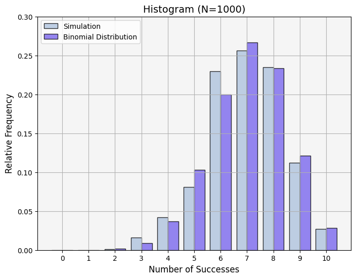

# bernoulli-trials
[Probability and Statistics] Binomial distribution simulation using statistically independent Bernoulli trials in Python.

Homework/project in **Probability and Statistics (13E082VISR)** at the University of Belgrade, School of Electrical Engineering.

## Simulation

### Bernoulli trials

Function `BernoullisTrials(n, p, N)` executes `N` independent simulations. Each simulation consists of `n` Bernoulli's experiments - `n` random numbers from interval [0,1] are generated and compared with the given probability of success `p`. The function returns a vector of length `n+1` containing relative frequencies of possible number of successful experiments during the simulation.

```
def BernoullisTrials(n, p, N):
	f = np.zeros(n + 1)
	for simulation in range(0, N):
		countSuccessfulTrials = 0
		for trial in range(0, n):
			if np.random.rand() < p:
				countSuccessfulTrials += 1
		f[countSuccessfulTrials] += 1
	return f / N
```

### Binomial distribution

The histogram shows relative frequencies obtained by simulating Bernoulli experiments (blue) and the actual binomial distribution probabilities (orange).



### Results

The simulation is repeated four times for various number of iterations (100 and 1000), and root-mean-square error is calculated for each simulation to compare the results with theoretical binomial distribution frequencies.

| Simulation | RMSE (N=100)  | RMSE (N=1000) |
| ---------- | ------------- | ------------- |
| No. 1      | 0.02404       | 0.00645       |
| No. 2      | 0.02109       | 0.00639       |
| No. 3      | 0.01871       | 0.00914       |
| No. 4      | 0.02452       | 0.00823       |
